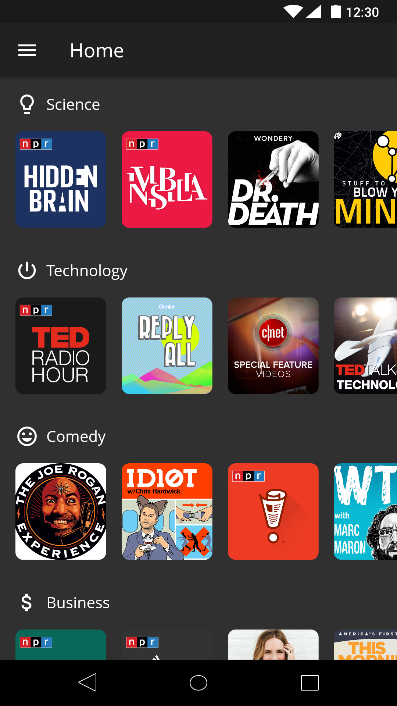
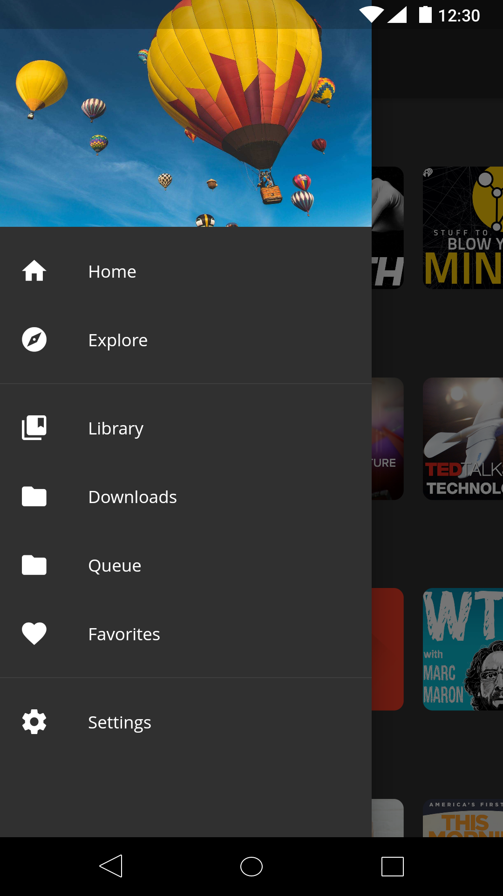
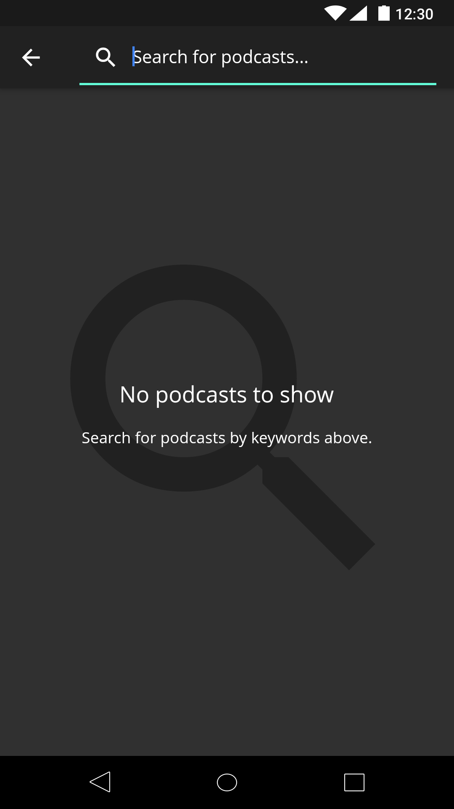
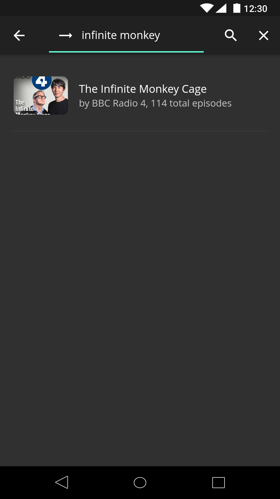
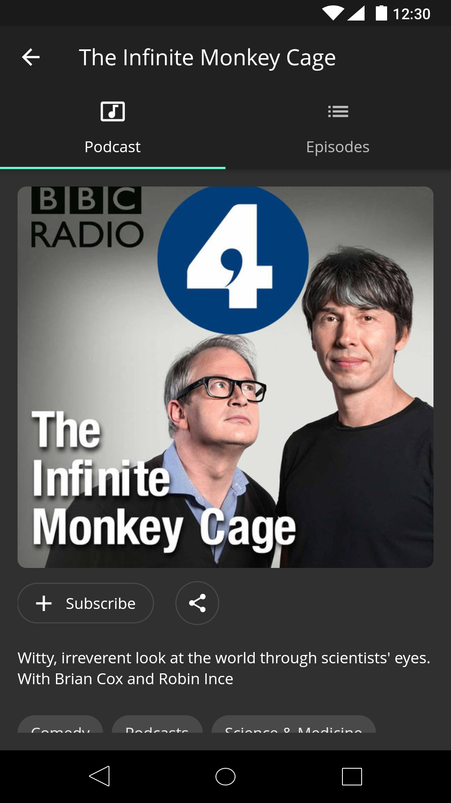
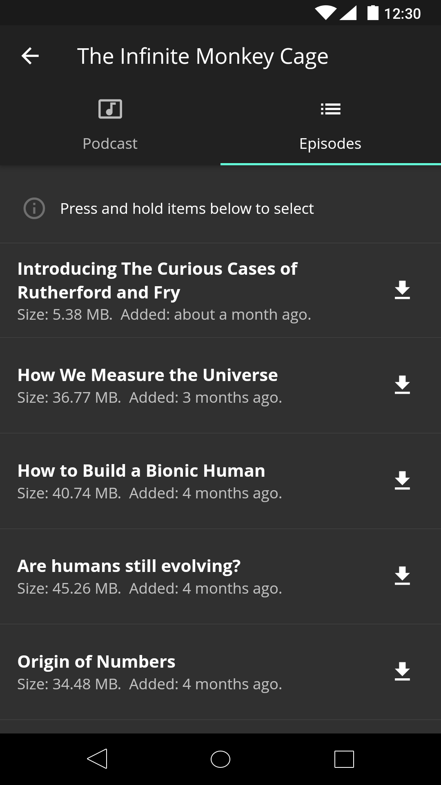
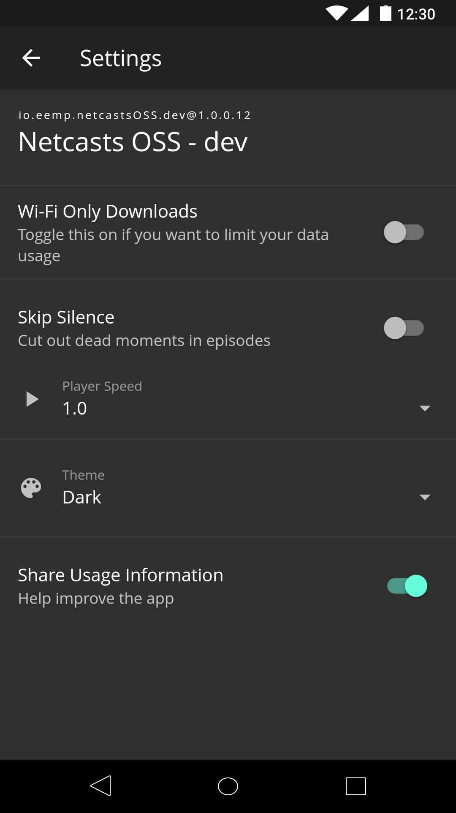

# Netcasts OSS

> Simple podcasts (netcasts) management powered by open source software

|Homepage|Drawer|Explore|Discover|
|-----|-----|-----|-----|
||||

|Podcast|Episodes|Player|Settings|
|-----|-----|-----|-----|
||||

## Why another podcast app?

* You want an ad-free app for your podcasts consumption
* You want an app powered by open source software
* You want an app you can clone, tinker with, and add functionality to
  * You have always had an idea that's been missing from your podcast app that you would like to see
  * We aren't designers :( - perhaps you can design a better theme for you
* You want to learn more about Flutter which powers this app

## Supported Features

* Find and subscribe to podcasts
* Download and play podcast episodes
* Share podcasts
* Favorite and share podcast episodes
* Limit data usage / download only when wifi is available
* Customize look and feel via themes

## Roadmap

* Better local notifications
* Chromecast support
* Allow development without requiring a datastore

## Contributing

Currently, I maintain a datastore with popular podcast data.  In order to
contribute, you would need information about this datastore.  As a substitute,
you are able to reproduce
this datastore using the [podcasts-fetcher](/packages/podcasts-fetcher) work.

## App Releases

I have not made what's required to release this app in the play store
(keys, release settings, etc) available via github.  It's essentially
what's in the flutter docs guiding developers through the release process.

## Getting Started

For help getting started with Flutter, view the official
[documentation](https://flutter.io/).

Find out more about the flutter developer experience
while [building this app](https://eemp.io/2019/02/04/first-serious-flutter-app/).
